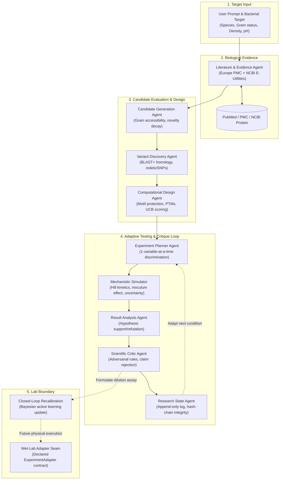

# BactroGen

An autonomous, multi-agent computational platform for target-driven bacteriocin discovery, sequence design, mechanistic simulation, and adaptive experimental planning.

## Why I Built It

BactroGen originated from a hackathon challenge proposing a six-agent multi-agent framework for bacteriocin research. In assessing the problem, I found the original scope insufficient for translational peptide discovery: six agents operating in a flat loop could retrieve papers and propose candidates, but lacked sequence-level variant discovery, post-translational modification (PTM) modeling, conservative design safeguards, and closed-loop experimental recalibration.

I expanded the system into a nine-agent architecture with dual orchestration (deterministic in-process execution and Omnigent MCP multi-agent protocol). The core iterative discovery cycle is driven by seven specialized agents, while two specialized sequence-level agents—Variant Discovery and Computational Design—expand the workflow from high-level candidate selection into sequence-level design, RiPP/PTM constraint modeling, and active-learning experimental planning.

## What It Does

BactroGen automates the iterative hypothesis-and-testing cycle for narrow-spectrum antimicrobial peptide discovery:

1. **Accepts a bacterial target and objective** (e.g., suppressing high-density *Listeria monocytogenes* at neutral pH).
2. **Retrieves structured evidence** from Europe PMC and NCBI (PubMed, PMC, Protein) with explicit citation provenance and contradiction tracking.
3. **Screens and ranks candidates** across a three-tier escalation ladder: known characterized bacteriocins first, natural database variants second, and *de novo* computational designs only when known rungs fall short.
4. **Discovers and characterizes sequence variants** via local or remote BLAST+ homology search and multiple sequence alignment.
5. **Performs mechanistic simulation** of candidate inhibition kinetics (Hill dose-response, inoculum effect, pH and temperature sensitivities) and reports predictions alongside explicit aleatoric and epistemic uncertainty.
6. **Critiques computational claims** through an adversarial scientific critic that rejects ungrounded extrapolations or missing citations before state acceptance.
7. **Formulates the next most informative experiment** using Bayesian Upper Confidence Bound (UCB) active learning, selecting conditions and microdilution ranges that maximize information gain.

## Architecture

The system features dual orchestration: a deterministic, fully reproducible Python engine (`DiscoveryWorkflowEngine`) with cycle guards and state integrity validation, and an external multi-agent deployment via the Model Context Protocol (MCP) for Omnigent.



### Specialist Agent Responsibilities

| Agent | Scope & Function | Transports / Boundaries |
|---|---|---|
| **Literature & Evidence** | Retrieves and structures abstracts from Europe PMC and NCBI (PubMed/Protein); extracts experimental conditions, measured units, contradictions, and evidence gaps. | In-process Python, MCP tool (`literature.py`) |
| **Candidate Generation** | Filters by target envelope (Gram-positive vs. Gram-negative), applies novelty decay across iterations, formulates falsifiable mechanism hypotheses. | In-process Python, MCP tool (`candidates.py`) |
| **Variant Discovery** | Extracts observed natural amino-acid substitutions, indels, and CDS mutations from homolog alignments; quantifies residue conservation without inventing sequences. | In-process Python, MCP tool (`candidates.py`) |
| **Computational Design** | Generates candidate variants with conservative physicochemical substitutions while strictly protecting essential motifs (Pediocin box `KYYGNGV`, Cysteines); models PTM/RiPP maturation constraints. | In-process Python, `/api/design/target` |
| **Experiment Planner** | Selects computational assay conditions that maximally discriminate competing hypotheses by varying one parameter at a time. | In-process Python, sub-agent |
| **Mechanistic Simulator** | Solves forward inhibition kinetics, Hill dose-response, and environmental sensitivity curves; reports predicted MIC/IC50 with aleatoric and epistemic uncertainty. | In-process Python, MCP tool (`runner.py`) |
| **Result Analysis** | Determines whether simulated outcomes support, weaken, or fail to distinguish active hypotheses; compares findings across iterations. | In-process Python, sub-agent |
| **Scientific Critic** | Adversarial referee that blocks claims lacking citations, flags excessive confidence, and halts ungrounded leaps before state commitment. | In-process Python, MCP tool (`critic.py`) |
| **Research State / Knowledge** | Maintains an append-only JSON event log, tracks open scientific questions, and enforces SHA-256 hash-chain state integrity. | In-process Python, MCP tool (`knowledge.py`) |

## Beyond the Original Challenge

The original hackathon prompt outlined six agents executing a basic conversational discovery loop. I made several substantive architectural expansions:

1. **Target-to-Bacteriocin 3-Tier Escalation Ladder**: Rather than immediately prompting an LLM to generate synthetic peptides, BactroGen enforces a strict biological hierarchy:
   - *Tier 1: Known characterized bacteriocins* (preferred; grounded in literature).
   - *Tier 2: Naturally occurring sequence variants* (observed in NCBI databases with accession provenance).
   - *Tier 3: Computational de novo designs* (reached only when known and natural candidates fail predicted efficacy thresholds).
2. **NCBI E-Utilities and Local/Remote BLAST+ Architecture**: Added full bioinformatics infrastructure—`NcbiClient` with token-bucket rate limiting (3 req/s public, 10 req/s authenticated), parameter redaction, PubMed/Protein ESearch/EFetch/ESummary parsing, and hybrid BLAST execution (local `blastp` with `-outfmt 6` tabular parsing or remote NCBI QBlast with timeout guards).
3. **Post-Translational Modification (PTM) & RiPP Modeling**: Ribosomally synthesized and post-translationally modified peptides (RiPPs, like Class I lantibiotics and lasso peptides) fail in linear sequence generators. BactroGen identifies putative modification sites (dehydrated Ser/Thr, lanthionine thioether rings, macrolactams, disulfide bridges) and applies structural uncertainty penalties to unmodeled 3D topologies.
4. **Physicochemical Sequence Constraint Engine**: Protects structural cysteines and conserved functional motifs (e.g., Class IIa Pediocin box `KYYGNGV`), restricting substitutions to physicochemical conservative pairs (e.g., Arg/Lys, Asp/Glu, Phe/Tyr).
5. **Bayesian Active Learning & Recalibration**: Integrated an Upper Confidence Bound (UCB) acquisition function ($\text{Acquisition} = \text{Score} + \kappa \cdot \sigma_{\text{epistemic}}$) that balances predicted efficacy with uncertainty, formulates 8-point geometric broth microdilution dilution series, and provides algorithmic recalibration (`recalibrate_and_rerank`).
6. **14 Directional Biology Invariants**: Built an automated verification harness (`selftest.py`) enforcing fundamental biological principles (e.g., monotonic dose-response, inoculum effect where higher cell density requires higher peptide concentration, denaturation at extreme pH/temperature).
7. **Comprehensive Web Platform**: Built a 10-page Next.js research console featuring 6 interactive specialist tools, dose-response sweep visualizations, and a live benchmark dashboard.

## Scientific Workflow

```text
Scientific Question / Bacterial Target
  │
  ▼
[Literature & Biological Data Retrieval]
  ├─ Europe PMC API (abstracts, experimental conditions)
  └─ NCBI E-Utilities (PubMed EFetch XML, NCBI Protein ESummary)
  │
  ▼
[Homology Search & Sequence Analysis]
  ├─ Local BLAST+ (blastp outfmt 6) or remote QBlast URL API
  └─ Alignment & Variant Extraction (substitutions, indels, CDS mapping)
  │
  ▼
[Candidate Evaluation & Hierarchical Design]
  ├─ Known bacteriocins scored for target envelope (Gram-positive / Gram-negative)
  ├─ Natural variants mined from database homologs
  └─ Computational sequence optimization (motif preservation, PTM profiling)
  │
  ▼
[Mechanistic Simulation & Uncertainty Estimation]
  ├─ Forward ODE / Hill dose-response modeling
  ├─ Environmental factors (pH, temperature, inoculum cell density)
  └─ Separation of aleatoric vs. epistemic uncertainty
  │
  ▼
[Adversarial Critique & Research Memory]
  ├─ Scientific Critic enforces citation and calibration rules
  └─ Knowledge Agent records append-only hash-chained event log
  │
  ▼
[Active Learning Validation Interface]
  ├─ UCB acquisition function selects most informative assay
  ├─ Formulates 8-point geometric broth microdilution series
  └─ Closed-loop algorithmic recalibration (recalibrate_and_rerank)
```

## Evidence, Predictions, and Validation

To preserve strict scientific integrity, BactroGen defines distinct evidence categories in its data contracts and user interface, strictly forbidding promotion across boundaries without experimental proof:

* **Published Evidence (`literature-derived`)**: Measurements and author conclusions extracted directly from peer-reviewed literature.
* **Database Evidence (`database-derived`)**: Accessions, sequences, and alignment metrics retrieved from NCBI Protein or BLAST.
* **Computational Simulation (`simulation-derived`)**: *In-silico* forward model predictions under defined pH, temperature, and inoculum conditions.
* **Model Prediction (`model-prediction`)**: Algorithmic rankings, candidate proposals, and design hypotheses generated by agents.
* **Wet-Lab Evidence (`wet-lab-derived`)**: Empirical bench measurements. Reserved exclusively for physical laboratory data.

> **Scientific Boundary**: Computational predictions are hypotheses, not experimental observations. A low simulated MIC or high predicted inhibition does not constitute biological proof of efficacy, and a sequence generated by the design agent has not been clinically or experimentally validated.

## Experimental Feedback / Lab Integration

BactroGen is architected to bridge computational discovery and experimental wet-lab validation:

* **What exists now (Implemented)**:
  - **`recalibrate_and_rerank`**: An algorithmic closed-loop recalibration engine in `bacteriocin_lab/agents/design/active_learning.py`. When an empirical observation (`ActivityObservation`) is provided, it updates the `ActivityCalibrator`, re-anchors candidate predictions, and reranks candidate hypotheses.
  - **Structured Assay Formulation**: The active learning engine automatically formulates actionable 8-point geometric dilution series (e.g., $0.125\times$ to $16\times$ predicted MIC) designed for standard 96-well broth microdilution assays.
  - **`WetLabAdapter` Seam**: A declared, discoverable architectural interface (`bacteriocin_lab/adapters/wetlab.py`) implementing the `ExperimentAdapter` contract.
* **What is future work / prototype**:
  - The `WetLabAdapter` currently reports `available=False` and raises `BackendUnavailableError`.
  - **No physical lab-equipment drivers** (such as Tecan, Hamilton, Opentrons, or microplate readers) are connected in this repository.
  - The closed-loop feedback engine currently operates on simulated or manually inputted test observations; automated bidirectional robotic execution remains an architectural boundary.

## Live Demo

Hosted research application: **[https://web-kappa-seven-35.vercel.app/research](https://web-kappa-seven-35.vercel.app/research)**

The web interface exposes:
* **Discover (`/research`)**: One-prompt end-to-end multi-agent discovery campaign.
* **Designer (`/design`)**: Target-to-bacteriocin hierarchical design ladder with PTM profiles and calibration curves.
* **Simulator (`/experiments`)**: Mechanistic simulation with interactive dose-response curves and sensitivity sweeps.
* **Candidates (`/candidates`)**: Candidate explorer with falsifiable hypotheses and novelty tracking.
* **Evidence (`/evidence`)**: Literature search with provenance attribution and citation extraction.
* **Advanced (`/advanced`)**: Direct launchers for all 12 underlying scientific subsystems.
* **Benchmarks (`/benchmarks`)**: Real-time KPI dashboard reflecting deterministic benchmark runs.
* **Methodology (`/methodology`)**: Formal documentation of evidence classification and provenance rules.

## Current Limitations

1. **Computational Predictions Require Wet-Lab Validation**: All potency, MIC, and inhibition figures generated by the simulator are mathematical models based on simplified biochemical priors. They cannot replace *in vitro* broth microdilution or animal models.
2. **Coarse Prior Calibration**: Mechanistic simulation priors are generalized and uncalibrated against high-throughput empirical datasets; predictions can deviate significantly in non-standard media or unmodeled bacterial strains.
3. **PTM Maturation Bottlenecks**: While the PTM engine flags RiPP dependence and penalizes structural uncertainty, linear sequence generation cannot predict whether heterologous host machinery will successfully express, dehydrate, or cyclize complex lantibiotic/lasso rings.
4. **Network and Service Latencies**: Live NCBI E-Utilities and Europe PMC queries depend on external API availability and strict rate limits (3–10 req/s). Remote NCBI QBlast queries are subject to NCBI queue delays and may time out; local BLAST+ installation is strongly recommended for production workflows.
5. **Absence of Physical Hardware Integration**: Automated physical pipetting and plate-reader ingestion are architectural interface seams (`WetLabAdapter`), not deployed hardware integrations.

## Validated System Status

The test suite enforces deterministic reproducibility and biological consistency:

* Full regression test suite: **822 passed, 5 skipped** (827 total tests in `pytest`).
* Simulator biology self-test: **14 directional invariants passed** (`python -m bacteriocin_sim selftest`).
* Full multi-agent deterministic loop: **PASS** (verified through iteration 2 and state integrity checks).
* Synthetic variant-calling gold standard: **100% precision and 100% recall** on substitution/indel extraction.
* Loop efficiency benchmark: **22.5× experiment reduction** (2 adaptive experiments vs. 45-point static screening grid).

## Running Locally

### Prerequisites
* Python 3.11+
* [`uv`](https://docs.astral.sh/uv/) (recommended package and venv manager)
* Node.js 18+ (for the optional Next.js web interface)
* Optional: Local NCBI BLAST+ (`blastp`) installed on `PATH` for offline homology search

### 1. Clone and Install
```bash
git clone https://github.com/kevinsrun/b-4.git
cd b-4
uv sync --all-extras
```

### 2. Run the Full Demo (API + Web Frontend)
```bash
./scripts/run_demo.sh
```
Opens `http://127.0.0.1:3000/research`. The launcher runs the FastAPI backend on port 8000 and Next.js on port 3000 in local deterministic mode. Press `Ctrl-C` to terminate both services.

### 3. Run the Deterministic Python Loop
```bash
uv run python -m bacteriocin_lab
```

### 4. Run with Omnigent MCP Multi-Agent Harness
Generate machine-specific MCP declarations and run the Omnigent orchestrator:
```bash
uv run python install.py
uv run python scripts/run_omnigent.py
```

### 5. Verification and Quality Checks
```bash
# Run full test suite (822 passed, 5 skipped)
uv run pytest -q

# Run biological invariant self-test
uv run python -m bacteriocin_lab.agents.simulator.selftest

# Run benchmark suite
uv run python -m benchmarks.run_all

# Run linting
uv run ruff check .

# Build web frontend
(cd web && npm ci && npm run typecheck && npm run build)
```

## Technical Stack

* **Core Platform**: Python 3.11+, Pydantic v2 schemas and validation contracts, `uv` packaging.
* **Bioinformatics**: NCBI E-Utilities (ESearch, EFetch, ESummary), Europe PMC API, NCBI BLAST+ (`blastp`), BioPython/custom alignment parsers.
* **Agent Framework & Protocols**: Model Context Protocol (MCP) tool servers (`FastMCP` / `MCPServer`), Omnigent multi-agent harness, in-process deterministic state graph with cycle guards.
* **Modeling & Active Learning**: Hill equation dose-response kinetics, Bayesian Upper Confidence Bound (UCB) acquisition, PTM classification engine.
* **Web & API Layer**: FastAPI, Uvicorn, Next.js 15 (App Router), React 19, Tailwind CSS, Recharts.
* **Quality Assurance**: `pytest` (827 collected tests), `ruff`, directional biological invariant harness (`selftest.py`).
