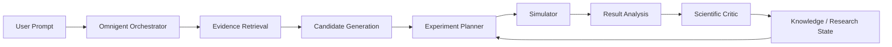

# BactroGen Research

**Autonomous AI for bacteriocin discovery, computational evaluation, and adaptive scientific experimentation.**

BactroGen Research turns a biological target and a scientific question into a bounded, provenance-aware research loop. It connects literature and database evidence to candidate generation, in-silico experiments, critique, and the next most informative experiment.

> **Hackathon status:** the local deterministic demo and the seven-agent Omnigent/MCP workflow are validated. A hosted judge URL is added here when the deployment handoff is complete.

## Try it

**Live app:** deployment URL pending final production handoff<br>
**Local demo:** `http://127.0.0.1:3000/research`

```text
Find the most promising bacteriocin for suppressing high-density Listeria monocytogenes.
```

The judge should see evidence retrieval, candidate ranking, a computational experiment, scientific critique, an adaptive next experiment, and one synthesized recommendation. Discover remains a one-prompt experience; the Advanced route exposes the research console when deeper inspection is useful.

## Why this matters

Antimicrobial resistance increases the need for targeted antimicrobial strategies. Bacteriocins are antimicrobial peptides produced by bacteria, but choosing the right peptide for the right target and condition is fragmented across papers, sequence databases, and modeling tools. BactroGen makes that investigation one auditable workflow. It does not claim clinical readiness or replace experimental validation.

## Architecture



Externally this is one seamless scientific assistant. Internally it is seven specialist agents exchanging structured outputs through MCP tools and the shared research contract:

1. **Evidence Retrieval** — retrieves and structures literature/database evidence with citations and missing fields.
2. **Candidate Generation** — ranks bacteriocin proposals and records falsifiable hypotheses.
3. **Experiment Planning** — chooses a bounded, information-seeking computational experiment.
4. **Simulation** — predicts response under explicit conditions; it never produces wet-lab evidence.
5. **Result Analysis** — compares results with hypotheses and prior iterations.
6. **Scientific Critic** — checks support, calibration, uncertainty, and prohibited claims.
7. **Knowledge / Research State** — preserves append-only history, transitions, open questions, and integrity checks.

## Quickstart

Requirements: Python 3.11+ and [`uv`](https://docs.astral.sh/uv/). Node.js is required for the optional web UI.

```bash
git clone https://github.com/kevinsrun/b-4.git
cd b-4
uv sync --all-extras
./scripts/run_demo.sh
```

Open `http://127.0.0.1:3000/research`. The launcher starts the API on port 8000 and the Next.js UI on port 3000 in deterministic local mode. Stop both services with Ctrl-C.

For the package-only deterministic loop:

```bash
uv run python -m bacteriocin_lab
```

To generate machine-specific Omnigent MCP declarations and run the orchestrator:

```bash
uv run python install.py
uv run python scripts/run_omnigent.py
```

Live NCBI/BLAST paths are opt-in. Configure only the variables described in [`.env.example`](.env.example); never commit a credential. Local BLAST+ is preferred when a database and `blastp` are configured, while remote NCBI requests are bounded and may time out.

## Technical stack

- Python package with Pydantic schemas and deterministic orchestration
- Omnigent orchestration with MCP tool servers
- FastAPI/uvicorn HTTP layer for the web UI
- Next.js/React frontend in `web/`
- Literature, PubMed/NCBI, protein retrieval, and optional BLAST/local sequence-search adapters
- pytest for behavioral and protocol tests

## Scientific rigor and provenance

The system keeps these evidence categories separate:

- **Published evidence** — measurements and author interpretations extracted from literature.
- **Database evidence** — records, accessions, and sequence-homology context.
- **Computational simulation** — in-silico predictions under explicit conditions.
- **Model prediction** — candidate rankings, hypotheses, and narrative interpretation.
- **Experimental evidence** — only present when real wet-lab measurements are supplied.

Simulation is not wet-lab validation. Literature evidence is not confirmation for a particular candidate and context. BLAST similarity is not proof of antimicrobial efficacy, and no BLAST hit is not proof of novelty. Designed variants are computational hypotheses requiring experimental validation.

## Validated system status

The current main branch has been validated with:

- **822 passed, 5 skipped** in the full deterministic suite (827 collected)
- build: **PASS**
- deterministic two-iteration adaptive loop: **PASS**
- seven real specialist agents: **confirmed**
- state-integrity verification: **PASS**
- bounded live NCBI smoke: **PASS**
- external Omnigent/MCP harness: all seven tools visible
- remote BLAST: handled safely as an external-service timeout when the bounded queue exceeds its limit

These results demonstrate a reproducible research workflow, not biological efficacy.

## Repository map

```text
bacteriocin_lab/
  shared/          schemas, provenance, IDs, configuration
  agents/          evidence, candidates, planner, simulator, analysis, critic, knowledge
  orchestration/   adaptive workflow, routing, Omnigent adapters
  adapters/        simulation and external-operation boundaries
  api/             FastAPI HTTP layer for the web UI
  evaluation/      demo scenarios and benchmark inputs
  tests/           unit, integration, API, and MCP protocol tests
agents/            Omnigent prompt/sub-agent declarations
tools/             MCP launchers and generated declaration examples
web/               Next.js/React Discover and Advanced console
scripts/           demo, Omnigent, and maintenance launchers
docs/              contracts and integration notes
```

## Limitations

- Computational predictions require experimental validation.
- The simulator is not a substitute for wet-lab experiments.
- Remote BLAST queue latency is unpredictable; local BLAST+ is preferred.
- NCBI and Omnigent live integrations depend on operator credentials and network availability.
- Designed variants are hypotheses, not validated therapies.
- The public demo uses bounded deterministic fixtures unless live retrieval is explicitly enabled.

## Development checks

```bash
uv run pytest -q
uv run ruff check .
(cd web && npm ci && npm run typecheck && npm run build)
```

The repository intentionally keeps the scientific claim boundary explicit: proposals and predictions are never silently promoted to observations or clinical conclusions.
